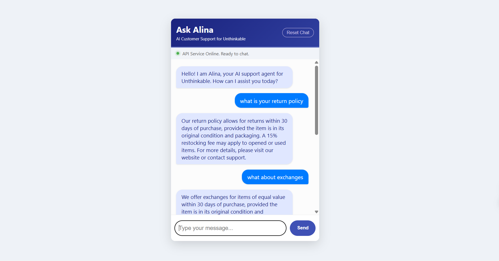
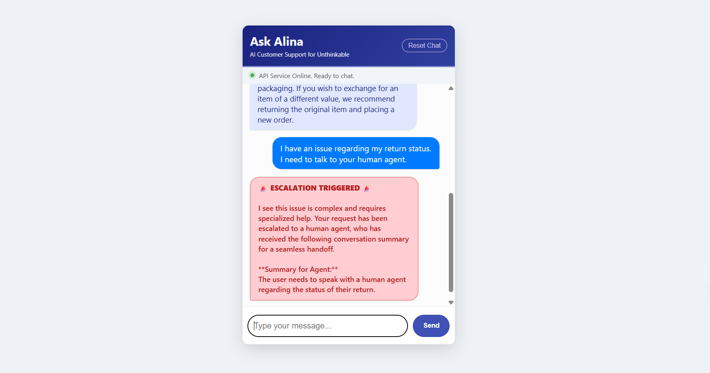

# 🤖 Ask Alina (AI Customer Support Bot)

**Full-stack Conversational AI Microservice**

[](https://opensource.org/licenses/MIT)
[](https://fastapi.tiangolo.com/)
[](https://ai.google.dev/models/gemini)
[](https://redis.io/)

## **📌 Overview & Project Value**

The **Ask Alina Bot** is a production-ready solution that simulates a customer service workflow by handling common FAQs, maintaining state, and autonomously escalating complex issues for human handoff.

This project showcases expertise in building scalable, reliable, and intelligent systems, with a focus on advanced LLM techniques.

## **✨ Project Demo & Visuals**

This project demonstrates the full application architecture, from the clean frontend UI to the critical backend logic (Escalation and De-escalation).

### **1. Live Chat Interface**

The user-facing chat window, built using HTML/JavaScript:



### **2. Escalation Logic Proof**

The output below shows the guaranteed structured handoff, which verifies the success of the Gemini Tool Calling implementation.



### **🔗 Live Application & API Access**

| Service | Status | Link |
| :--- | :--- | :--- |
| **Frontend Demo** | Live | [Launch Chat](https://alinaaaaaa-2003.github.io/alina-ask-assist-bot/) |
| **Backend API Docs** | Live | [Test Endpoints](https://alina-ask-assist-bot.onrender.com/docs) |


## **⭐ Key Features for Recruiters (The Differentiators)**

| Feature | Technical Implementation | Value Proposition |
| :--- | :--- | :--- |
| **Guaranteed Escalation** | Utilizes **Gemini Tool/Function Calling** to enforce structured output. The LLM is *forced* to return a JSON object, eliminating conversational errors. | Proves mastery of modern LLM constraints and structured data handling. |
| **Contextual De-escalation Logic** | Custom logic in `main.py` detects when a session is in an "escalated" state and **resets the context** for the next simple FAQ. | Solves a major real-world UX flaw where bots get stuck repeating urgent phrases. Demonstrates thoughtful system architecture. |
| **Production-Ready Stack** | Separated architecture: **FastAPI** (API) calls **Redis** (Memory) and **Gemini** (Logic). | Shows ability to design and deploy services using industry-standard microservice principles (separation of concerns). |
| **Ephemeral Memory** | Uses **Redis Lists** (`LPUSH`/`LTRIM` in `memory_handler.py`) to manage a fixed-size conversation window. | Demonstrates optimization for speed and memory efficiency in a cloud environment. |

## **🛠️ Technical Stack & Architecture**

| Component | Technology | Role in System |
| :--- | :--- | :--- |
| **Backend API** | Python / **FastAPI** | REST API endpoints, routing, and overall orchestration. |
| **LLM Engine** | **Gemini 2.5 Flash API** | Response generation, escalation decision-making, and conversation summarization. |
| **Database** | **Redis (Key-Value/List Store)** | High-speed, in-memory storage for conversational context (`session_id` keys). |
| **Frontend** | HTML / CSS / Vanilla JavaScript | Functional and visually improved chat interface for demonstration. |
| **Deployment** | **Render** (FastAPI/Redis) & **GitHub Pages** (Frontend) | Production-ready, separate hosting for scalability and separation of concerns. |

## **🚀 Local Setup and Quick Start**

### **Prerequisites**

1.  **Python 3.10+**
2.  **Redis Server** (Running locally via Docker or WSL)
3.  **Gemini API Key** (Set as environment variable)

### **Local Commands**

1.  **Clone the repository:**

    ```bash
    git clone https://github.com/alinaaaaaa-2003/alina-ask-assist-bot.git
    cd alina-ask-assist-bot
    ```

2.  **Setup Environment & Install Dependencies:**

    ```bash
    python3 -m venv venv
    . .\venv\Scripts\Activate.ps1   # (For PowerShell)
    pip install -r requirements.txt
    ```

3.  **Set API Key (MUST BE DONE BEFORE RUNNING):**

    ```powershell
    $env:GEMINI_API_KEY="YOUR_GEMINI_API_KEY_HERE"
    ```

4.  **Run the FastAPI Backend:**

    ```powershell
    uvicorn main:app --reload
    ```

5.  **Access:** Open `http://127.0.0.1:8000` in your browser (it will redirect to the Swagger UI).

6.  **Test Frontend:** Open the local **`index.html`** file directly in your browser.

## **📝 LLM Usage Guidance and Prompts**

The system uses different prompts for its two primary functions.

### **1. Escalation/Response Prompt (System-Level)**

This strict prompt is provided to the Gemini model to establish its persona and enforce the escalation decision.

| Instruction | Purpose |
| :--- | :--- |
| **Persona:** `You are 'Alina', a friendly and professional customer support agent...` | Sets the helpful and professional tone. |
| **CRITICAL RULE:** `If the user's query is complex... you MUST invoke the 'escalate_to_human' tool immediately.` | Directs the model to use the **Function/Tool** (defined in code) instead of providing a text answer for urgent queries. |

### **2. Summarization Prompt**

This prompt is called by the backend *after* an escalation to generate a report for the human agent.

| Instruction | Purpose |
| :--- | :--- |
| **Persona:** `You are a neutral assistant.` | Prevents the model from being overly critical (like the "senior support lead" persona) and ensures objective summarization. |
| **Constraint:** `Summarize... into a single, concise sentence. Do not critique the bot's actions or use bullet points.` | Forces clean, factual output ready for a seamless human handoff. |

-----

## **✅ Conclusion**

This project demonstrates proficiency in multi-service architecture, robust API design, and cutting-edge LLM integration techniques required for a modern AI/ML role.
